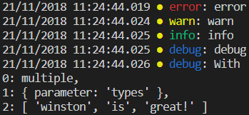
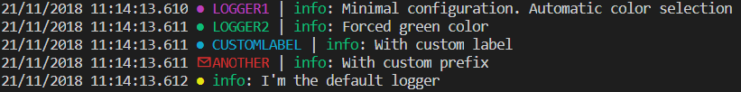

# wraps-logger
_Work in progress!!_

Winston wrapping function for logging

## Installation
`npm install wraps-logger`

## Usage
### Default logger
```typescript
import { logger } from 'wraps-logger'
logger.error('error');
logger.warn('warn');
logger.info('info');
logger.debug('debug');
logger.silly('silly!');
logger.debug('With', 'multiple', {parameter: 'types'}, ['winston','is','great!'])
```


### Adding custom namespaces
```typescript
import { COLORS, createNamespace, logger } from 'wraps-logger';

const nsp1 = createNamespace('LOGGER1');
const nsp2 = createNamespace('LOGGER2', {level: 'info'}, {color: COLORS.GREEN});
const nsp3 = createNamespace('LOGGER3', {level: 'debug'}, {label: 'CUSTOMLABEL'});
const nsp4 = createNamespace('ANOTHER', {level: 'debug'}, {prefix: '\u2709'});

nsp1.info('Minimal configuration. Automatic color selection');
nsp2.info(`Forced green color`);
nsp3.info(`With custom label`);
nsp4.info(`With custom prefix`);
logger.info(`I'm the default logger`);
```


